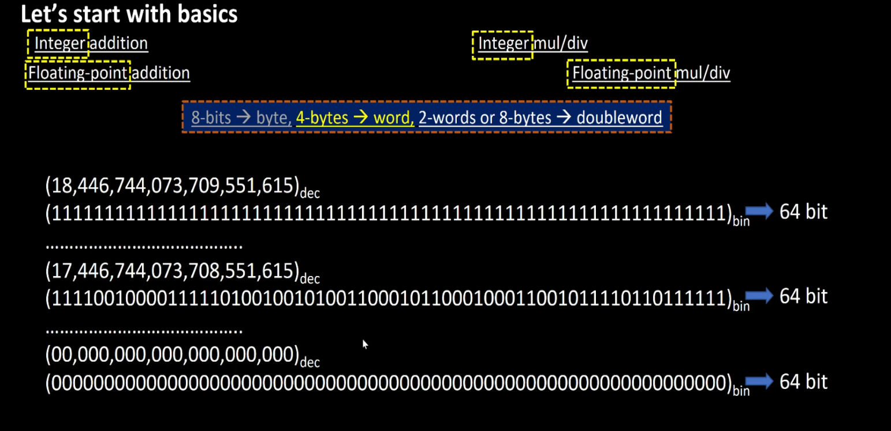
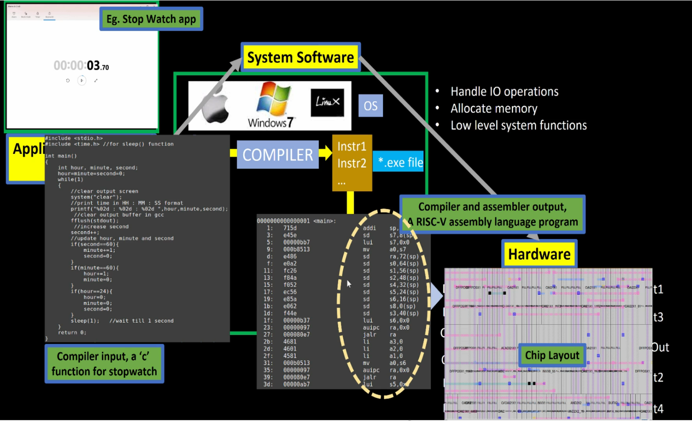

# Day 1 - Introduction to RISC-V ISA and GNU Compiler Toolchain

## Overview

Day 1 introduced the fundamentals of the RISC-V Instruction Set Architecture (ISA), GNU compiler toolchain, software-to-hardware abstraction, and integer number representation.

The objective was to understand how a high-level C program is translated into machine instructions and eventually executed by RISC-V hardware.

Topics such as ISA, compiler flow, assembler operation, ABI, instruction extensions, memory organization, signed and unsigned numbers, and two's complement representation were discussed.

---

## Workshop Progress

| Day | Topic | Status |
|------|--------|---------|
| Day 1 | Introduction to RISC-V ISA and GNU Compiler Toolchain | ✅ Completed |
| Day 2 | ABI and Verification Flow | ⏳ Pending |
| Day 3 | Digital Logic with TL-Verilog and Makerchip | ✅ Completed |
| Day 4 | Basic RISC-V CPU Microarchitecture | ✅ Completed |
| Day 5 | Complete Pipelined RISC-V CPU | ✅ Completed |

---

## Topics Covered

### RV-D1SK1

* Introduction to RISC-V
* Instruction Set Architecture (ISA)
* Software and Hardware Abstraction
* Compiler and Assembler Flow
* RV64I Base Instruction Set
* RV64M Multiply Extension
* RV64F and RV64D Floating Point Extensions
* Application Binary Interface (ABI)
* Stack Pointer and Memory Allocation
* Pseudo Instructions

### RV-D1SK2

* GNU Toolchain
* GCC Compilation Flow
* C Program Compilation
* Assembly Generation
* Object File Generation
* Disassembly using objdump

### RV-D1SK3

* Integer Number Representation
* Signed and Unsigned Numbers
* Two's Complement Representation
* MSB and LSB
* RV64 Number Range
* Word and Doubleword Representation

---

## Repository Structure

```text
Day1/
│
├── README.md
├── notes.md
├── observations.md
├── riscv_keywords.md
├── gcc_toolchain.md
├── integer_representation.md
├── code/
└── screenshots/
```

---

## Important Concepts

### Software to Hardware Flow

```text
Application Software
        ↓
Compiler
        ↓
Assembly Code
        ↓
Assembler
        ↓
Machine Code
        ↓
RISC-V ISA
        ↓
RTL Implementation
        ↓
Physical Hardware
```

---

### RISC-V Extensions

| Extension | Description |
|------------|------------|
| RV64I | Base Integer Instruction Set |
| RV64M | Integer Multiplication and Division |
| RV64F | Single Precision Floating Point |
| RV64D | Double Precision Floating Point |

---

## Screenshots

### Introduction to RISC-V


Topics:

* Introduction to RISC-V
* Software and Hardware Interaction
* ISA Fundamentals

---

### Software to Hardware Flow


Topics:

* Application Software
* System Software
* Compiler
* Hardware Execution

---

### Instruction Set Architecture (ISA)


Topics:

* ISA Abstraction
* Software-Hardware Interface
* Instruction Execution

---

### RTL Integration Flow


Topics:

* ISA
* RTL Design
* Physical Hardware
* Silicon Implementation

---

### Base Integer Instruction Set (RV64I)


Topics:

* Integer Arithmetic
* Memory Operations
* Base Instruction Set

---

### Multiply Extension (RV64M)


Topics:

* Multiplication
* Division

---

### Floating Point Extensions


Topics:

* Single Precision Operations
* Double Precision Operations

---

### Pseudo Instructions


Topics:

* mv
* li
* ret

---

### Application Binary Interface (ABI)


Topics:

* Register Usage
* Function Calling Convention
* Parameter Passing

---

### Stack Pointer


Topics:

* Stack Allocation
* Local Variables
* Function Calls

---

### Unsigned Number Representation


Topics:

* Binary Representation
* Unsigned Numbers
* Number Range

---

### Binary Pattern Identification


Topics:

* Binary Patterns
* Number Representation
* Bit Width Scaling

---

### Byte, Word and Doubleword Organization


Topics:

* Byte
* Word
* Doubleword
* Bit Organization

---

### RV64 Unsigned Number Range



Topics:

* Lower Limit
* Upper Limit
* RV64 Capacity

---

### Signed Number Representation


Topics:

* Signed Numbers
* Two's Complement

---

### MSB Based Signed Number Identification


Topics:

* Sign Bit
* Positive Numbers
* Negative Numbers

---

### Signed Number Range


Topics:

* Positive Range
* Negative Range
* RV64 Signed Values

---

### Stopwatch Example



Topics:

* Embedded Systems
* Timing Applications
* Hardware Abstraction

### Introduction to Number Representation


Topics:

* Byte
* Word
* Doubleword
* Signed Numbers
* Unsigned Numbers

---


## Key Learning Outcomes

By the end of Day 1, I understood:

* What an ISA is and why it is important
* How software communicates with hardware
* The role of compilers and assemblers
* RV64 architecture basics
* Signed and unsigned number representation
* Two's complement arithmetic
* ABI and stack pointer usage
* RISC-V instruction extensions
* Relationship between ISA, RTL and physical silicon

---

## Files

### Notes

```text
Day1/notes.md
```

Detailed lecture notes covering ISA fundamentals, compiler flow, ABI, instruction extensions, and software-to-hardware abstraction.

---

### Observations

```text
Day1/observations.md
```

Key takeaways and practical insights gained during Day 1.

---

### RISC-V Keywords

```text
Day1/riscv_keywords.md
```

Reference guide for important RISC-V terminology.

---

### GNU Toolchain

```text
Day1/gcc_toolchain.md
```

Documentation of GCC compilation flow and toolchain usage.

---

### Integer Representation

```text
Day1/integer_representation.md
```

Detailed explanation of signed and unsigned number representation and two's complement arithmetic.

---

## Conclusion

Day 1 established the foundational concepts required for the rest of the RISC-V MYTH Workshop. It introduced the software-to-hardware execution flow, RISC-V ISA fundamentals, compiler toolchain operation, ABI concepts, and integer number representation. These concepts form the basis for understanding processor microarchitecture, RTL implementation, and CPU design in the subsequent workshop days.