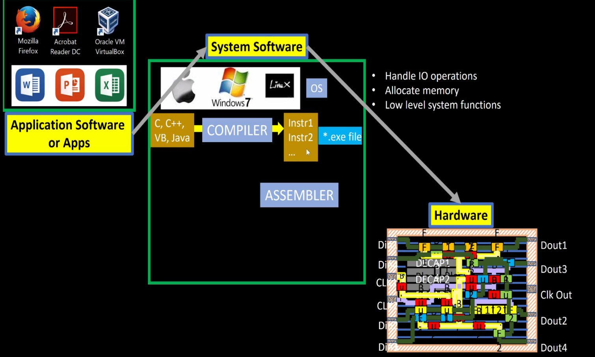
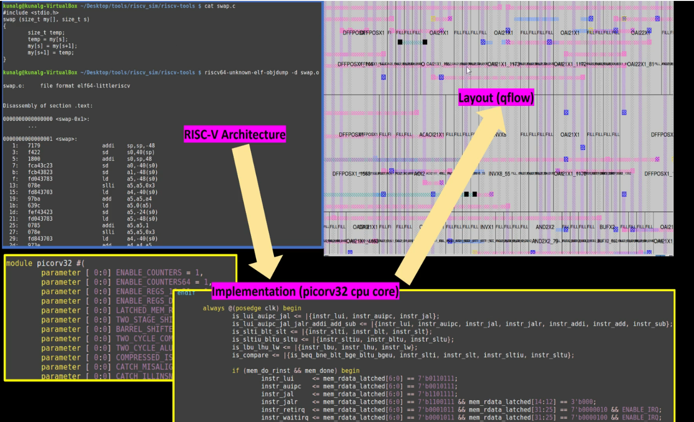
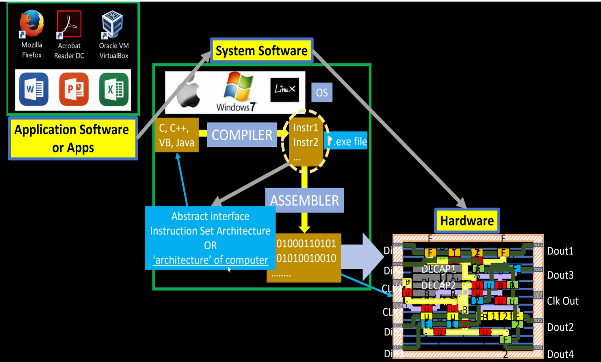
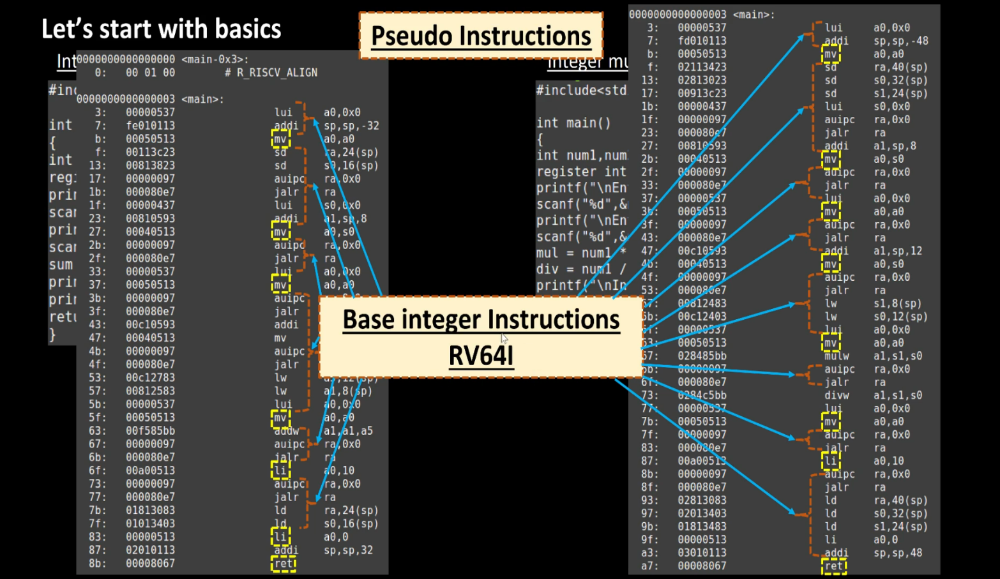
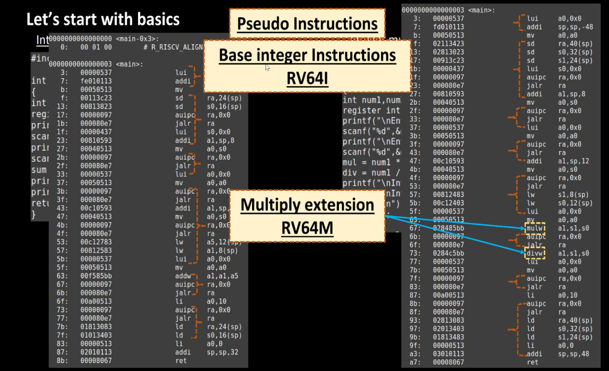
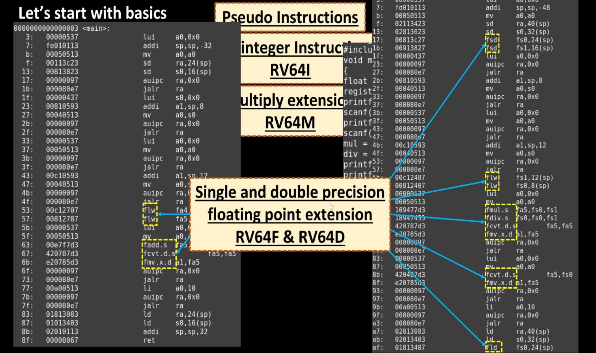
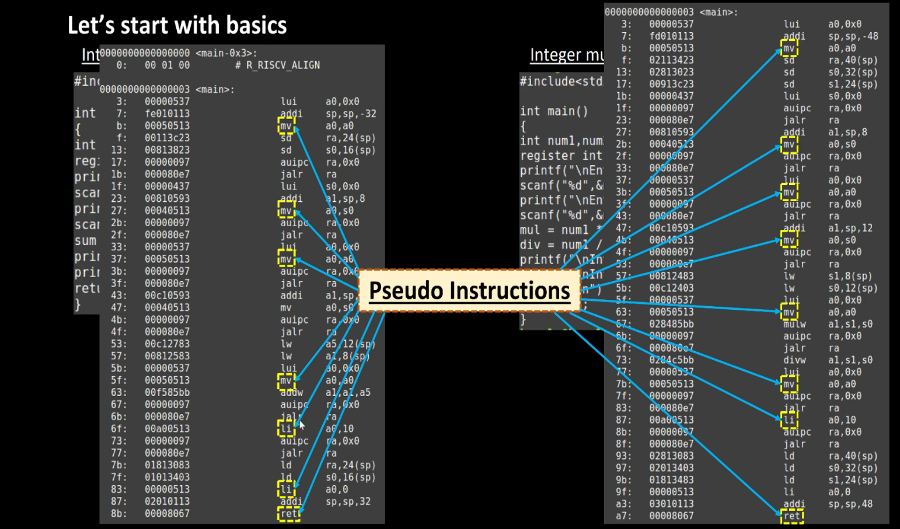
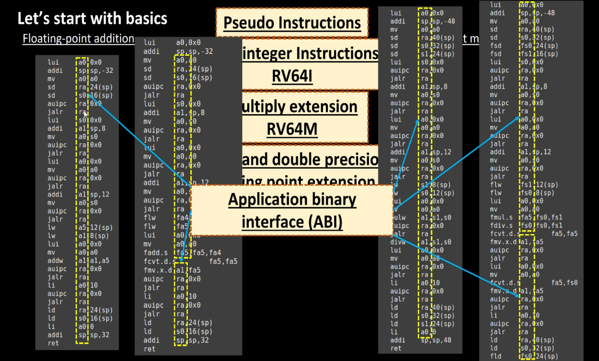
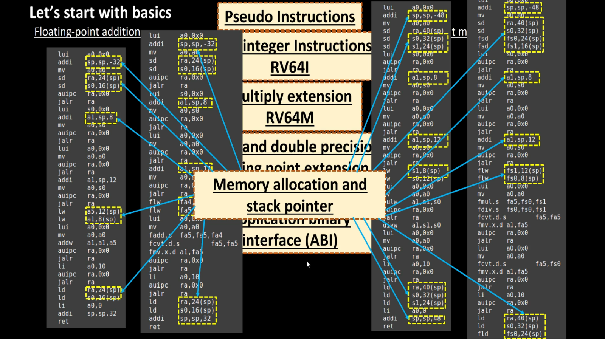
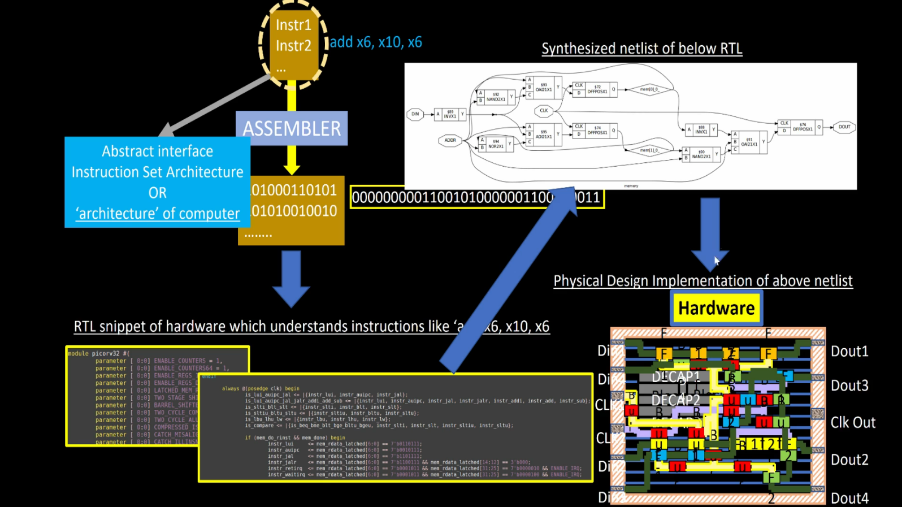

# GNU Compiler Toolchain and Software-to-Hardware Flow

## Overview

The GNU Toolchain converts a high-level C program into machine instructions that can be executed by a RISC-V processor.

Day 1 introduced the complete path from software development to hardware execution.

---

## Software and Hardware Relationship

A processor does not understand C code directly.

The processor only understands machine instructions represented as binary patterns.

The compiler and assembler act as translators between software and hardware.

---

## Complete Flow

```text
C Program
    ↓
Compiler
    ↓
Assembly Code
    ↓
Assembler
    ↓
Machine Code
    ↓
RISC-V Processor
```

### Screenshot



---

## Step 1: Application Software

Application software is written by programmers.

Examples:

* Calculator
* Browser
* Stopwatch
* Media Player

Languages:

* C
* C++
* Java
* Visual Basic

### Screenshot



---

## Step 2: System Software

System software provides services to application programs.

Examples:

* Windows
* Linux
* macOS

Responsibilities:

* Memory Management
* I/O Handling
* File System Access
* Process Scheduling

### Screenshot


---

## Step 3: Compiler

The compiler converts high-level language code into assembly language.

Example:

### C Code

```c
a = b + c;
```

Compiler Output:

```assembly
add x5,x6,x7
```

The compiler understands:

* Data Types
* Variables
* Loops
* Functions

---

## Step 4: Assembler

The assembler converts assembly instructions into machine code.

Example:

```assembly
add x5,x6,x7
```

becomes

```text
00000000111000110000001010110011
```

Machine code is the actual input to the processor.

### Screenshot



---

## What is ISA?

ISA stands for:

```
Instruction Set Architecture
```

It acts as the interface between:

```text
Software
    ↕
ISA
    ↕
Hardware
```

The ISA defines:

* Instructions
* Registers
* Memory Operations
* Data Formats

### Screenshot


---

## RISC-V Instruction Extensions

### RV64I

Base Integer Instruction Set

Examples:

```assembly
add
sub
addi
lui
ld
sd
```

### Screenshot



---

### RV64M

Multiply Extension

Examples:

```assembly
mul
div
```

### Screenshot



---

### RV64F and RV64D

Floating Point Extensions

Examples:

```assembly
fadd
fmul
fdiv
fld
fsd
```

### Screenshot



---

## Pseudo Instructions

Pseudo instructions make assembly programming easier.

Examples:

```assembly
mv
li
ret
```

The assembler automatically expands them into actual RISC-V instructions.

### Screenshot



---

## ABI (Application Binary Interface)

ABI defines how software communicates with hardware and operating systems.

It specifies:

* Register usage
* Function calling conventions
* Argument passing
* Return values

### Screenshot



---

## Stack Pointer

The stack pointer register:

```assembly
sp = x2
```

is used for:

* Local variables
* Function calls
* Saving registers
* Return addresses

### Screenshot



---

## ISA to Silicon

The machine instructions generated by the compiler eventually execute on actual hardware.

Complete Semiconductor Flow:

```text
C Program
    ↓
Compiler
    ↓
Assembly
    ↓
Machine Code
    ↓
ISA
    ↓
RTL Design
    ↓
Synthesis
    ↓
Gate-Level Netlist
    ↓
Physical Design
    ↓
Silicon Chip
```

### Screenshot



---

## Key Takeaways

* Processors do not execute C code directly.
* Compilers convert high-level code into assembly.
* Assemblers generate machine code.
* ISA acts as the bridge between software and hardware.
* RISC-V supports modular extensions such as RV64I, RV64M, RV64F, and RV64D.
* Understanding the GNU toolchain is fundamental for CPU design and verification.
* Every hardware implementation ultimately exists to execute ISA instructions correctly.