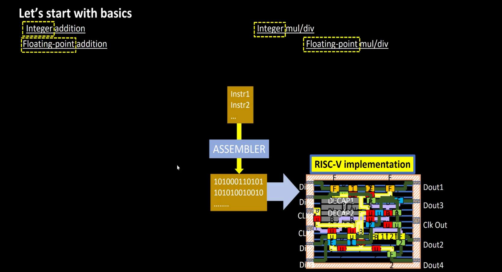
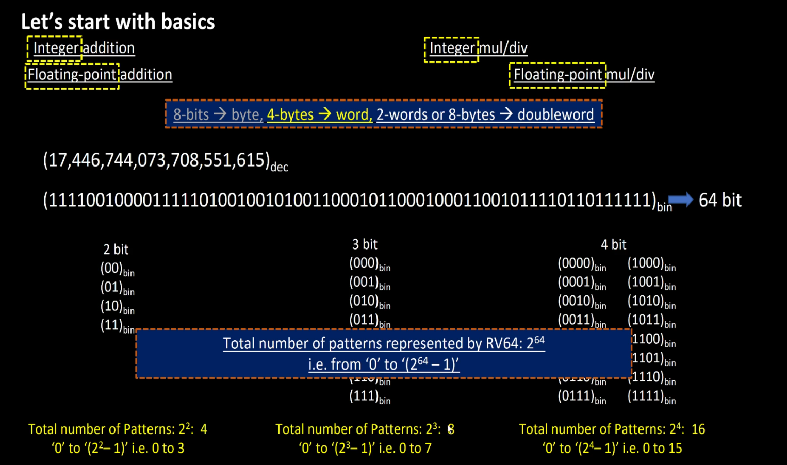
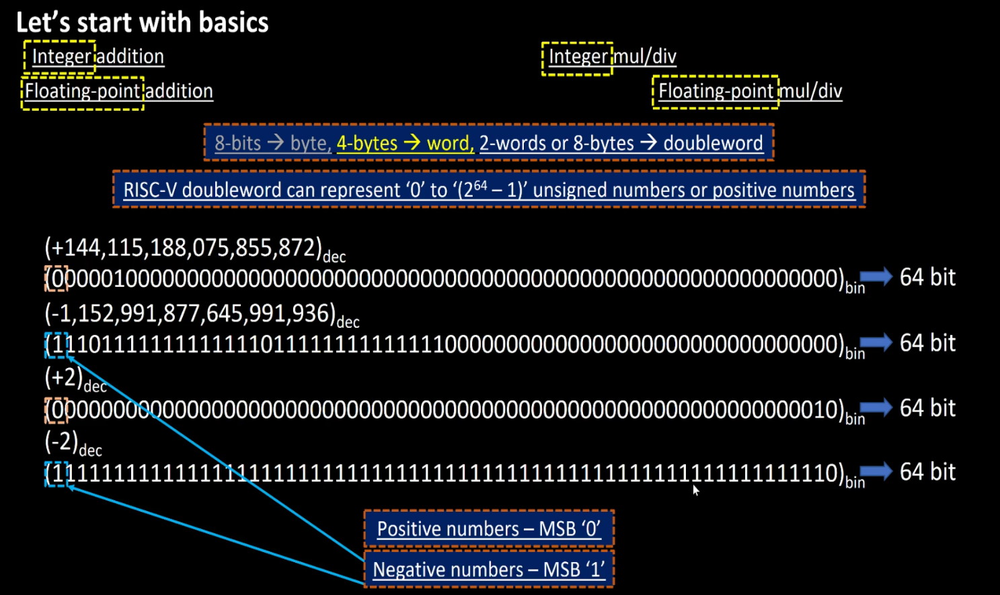
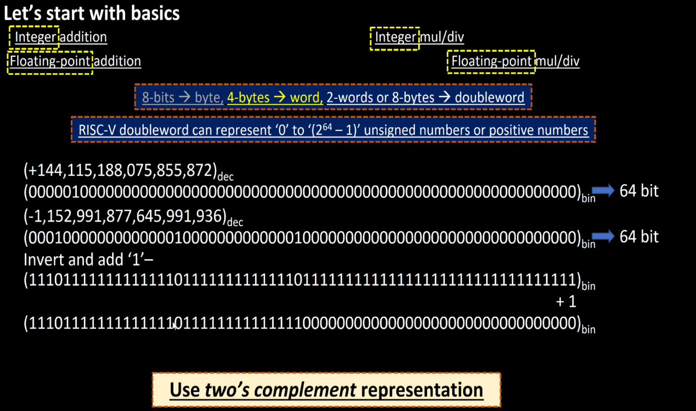
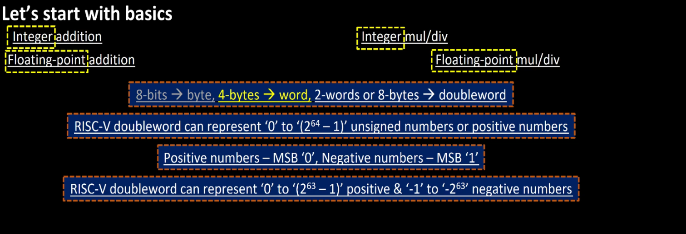
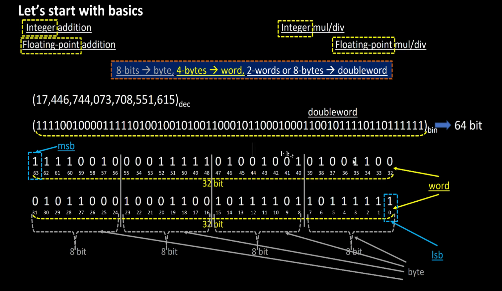

# Day 1 Notes - Introduction to RISC-V ISA and GNU Compiler Toolchain

## 1. Basic Arithmetic Operations

RISC-V supports:

### Integer Operations

* Integer Addition
* Integer Subtraction
* Integer Multiplication
* Integer Division

### Floating Point Operations

* Floating Point Addition
* Floating Point Multiplication
* Floating Point Division

---

## 2. Data Sizes

| Size | Description |
|---------|-------------|
| 8 bits | Byte |
| 32 bits | Word |
| 64 bits | Doubleword |

RV64 processors primarily operate on:

```text
64-bit Doubleword
```

---

## 3. Unsigned Number Representation

For an N-bit number:

```text
0 → (2^N - 1)
```

For RV64:

```text
0 → (2^64 - 1)
```

Maximum value:

```text
18,446,744,073,709,551,615
```

### Screenshot



---

## 4. Number of Possible Patterns

For N bits:

```text
2^N
```

Examples:

| Bits | Patterns |
|--------|----------|
| 2 | 4 |
| 3 | 8 |
| 4 | 16 |
| 64 | 2^64 |

### Screenshot



---

## 5. Signed Number Representation

Signed numbers use the MSB as the sign bit.

| MSB | Meaning |
|-------|---------|
| 0 | Positive |
| 1 | Negative |

### Screenshot



---

## 6. Two's Complement Representation

Negative numbers are represented using:

```text
Invert Bits
+
Add 1
```

Example:

```text
+2

00000010

Invert

11111101

Add 1

11111110
```

Result:

```text
-2
```

### Screenshot



---

## 7. Signed Range in RV64

Positive range:

```text
0 → (2^63 -1)
```

Negative range:

```text
-1 → -2^63
```

### Screenshot



---

## 8. Word and Doubleword Layout

RV64 data organization:

```text
Doubleword = 64 bits

Word 0 = Lower 32 bits
Word 1 = Upper 32 bits

Byte = 8 bits
```

MSB:

```text
Bit 63
```

LSB:

```text
Bit 0
```

### Screenshot



---

## 9. Instruction Set Architecture (ISA)

ISA defines:

* Instruction format
* Registers
* Memory access
* Processor behavior

Acts as an abstraction layer between software and hardware.

### Screenshot


---

## 10. Software to Hardware Flow

```text
Application
     ↓
Compiler
     ↓
Assembly
     ↓
Machine Code
     ↓
RTL Implementation
     ↓
Netlist
     ↓
Physical Design
     ↓
Silicon
```

### Screenshot


---

## 11. RISC-V Base Integer Instructions

RV64I includes:

* add
* sub
* addi
* lui
* ld
* sd
* jalr

### Screenshot


---

## 12. Multiply Extension

RV64M adds:

* mul
* div

### Screenshot


---

## 13. Floating Point Extensions

RV64F:

* Single Precision

RV64D:

* Double Precision

Instructions:

* fadd
* fmul
* fdiv
* fld
* fsd

### Screenshot


---

## 14. Pseudo Instructions

Examples:

```assembly
mv
li
ret
```

Pseudo instructions are translated by the assembler into actual machine instructions.

### Screenshot


---

## 15. Application Binary Interface (ABI)

ABI defines:

* Register usage
* Function call conventions
* Parameter passing
* Return values

### Screenshot


---

## 16. Stack Pointer

Register:

```text
sp = x2
```

Purpose:

* Function call storage
* Local variables
* Return addresses

### Screenshot


---