# Day 3 - Digital Logic with TL-Verilog and Makerchip

## Overview

Day 3 focused on understanding digital logic design using TL-Verilog and Makerchip. The objective was to learn how combinational and sequential logic are implemented using timing abstraction and pipeline stages.

The day introduced key RTL design concepts such as:

* Combinational Logic
* Sequential Logic
* Pipeline Stages
* Timing Abstraction
* Signal Alignment
* Validity Logic
* Feedback Paths
* Memory Elements
* Hierarchical Design

---

## Workshop Progress

| Day   | Topic                                                 | Status      |
| ----- | ----------------------------------------------------- | ----------- |
| Day 1 | Introduction to RISC-V ISA and GNU Compiler Toolchain | ⏳ Pending   |
| Day 2 | Introduction to ABI and Basic Verification Flow       | ⏳ Pending   |
| Day 3 | Digital Logic with TL-Verilog and Makerchip           | ✅ Completed |
| Day 4 | Basic RISC-V CPU Microarchitecture                    | 🚧 Upcoming |
| Day 5 | Complete Pipelined RISC-V CPU Microarchitecture       | 🚧 Upcoming |

---

## Repository Structure

```text
riscv-myth-workshop_devdutt/
│
├── Day1/
├── Day2/
├── Day3/
│   ├── README.md
│   ├── notes.md
│   ├── observations.md
│   ├── code/
│   └── screenshots/
│
├── Day4/
├── Day5/
│
└── README.md
```

---

## Learning Objectives

This repository documents my journey through the RISC-V based MYTH Workshop, covering:

* RISC-V ISA Fundamentals
* GNU Toolchain
* ABI Concepts
* Verification Flow
* TL-Verilog and Makerchip
* CPU Microarchitecture
* Pipelined RISC-V CPU Design

The goal is to build a strong foundation in RTL Design, Computer Architecture, and RISC-V Processor Design through hands-on labs, notes, screenshots, and implementation exercises.


## Topics Covered

### 1. Logic Gates

Implemented basic logic operations:

* Inverter (NOT)
* AND
* OR
* XOR

---

### 2. Multiplexer Design

Implemented multiplexers using conditional operators and understood how hardware selects one of many inputs.

---

### 3. Combinational Calculator

Implemented:

* Addition
* Subtraction
* Multiplication
* Division

using a mux-controlled arithmetic datapath.

---

### 4. Sequential Calculator

Introduced feedback using:

```tlv
>>1$out
```

allowing the calculator to reuse previous results and create stateful behavior.

---

### 5. Counter Design

Implemented a sequential counter using feedback paths.

Key concept:

```tlv
$cnt = >>1$cnt + 1
```

---

### 6. Pipeline Stages

Learned timing abstraction using:

```tlv
@1
@2
@3
```

instead of manually writing registers and always_ff blocks.

---

### 7. Two-Cycle Calculator

Modified the calculator to operate across multiple pipeline stages.

Introduced:

```tlv
>>2$out
```

to support multi-cycle feedback.

---

### 8. Validity Logic

Implemented conditional execution using:

```tlv
?$valid
```

to allow computations only when data is valid.

---

### 9. Single Value Memory

Extended the calculator with:

* Memory Store
* Memory Recall

using internal state retention.

---

### 10. Hierarchical Design

Used hierarchy replication:

```tlv
/coord[1:0]
```

to create replicated coordinate structures.

---

## Labs Completed

* Inverter Gate
* Boolean Operators
* Combinational Calculator
* Sequential Calculator
* Counter
* Two-Cycle Calculator
* Validity Logic
* Single Value Memory Calculator
* Pythagoras Pipeline

---

## Screenshots

### Introduction

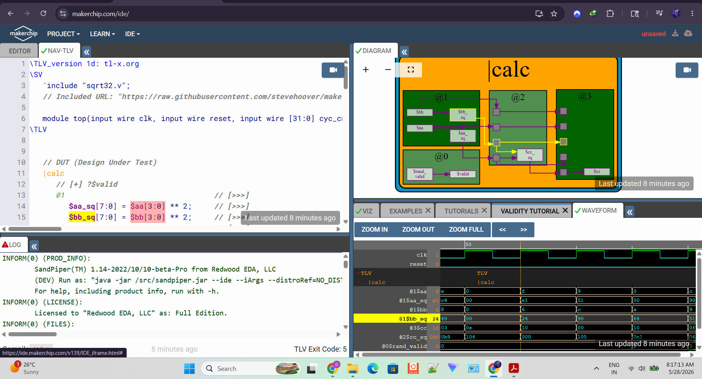

### Inverter Gate

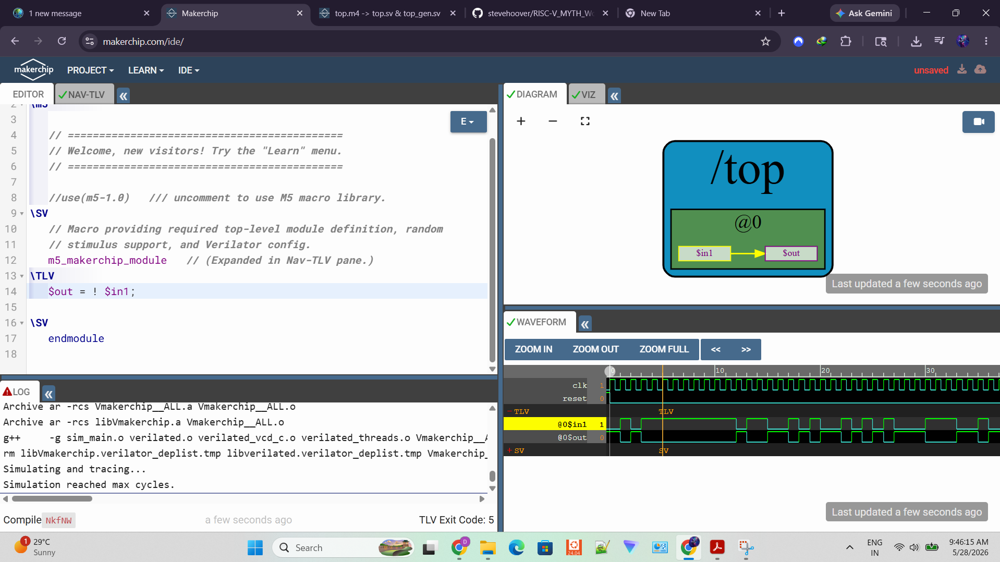

### Logic Gates

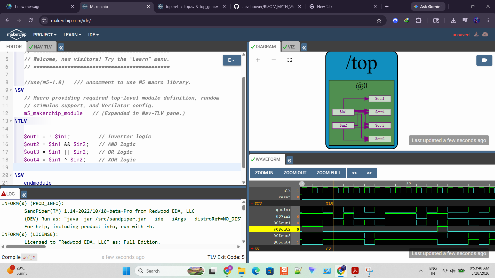

### Vectors

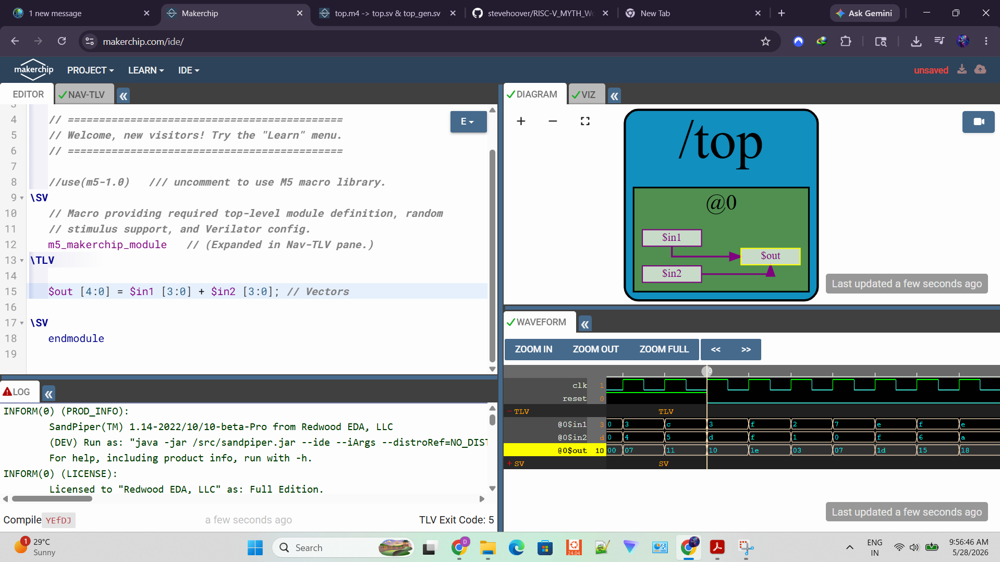

### Multiplexer

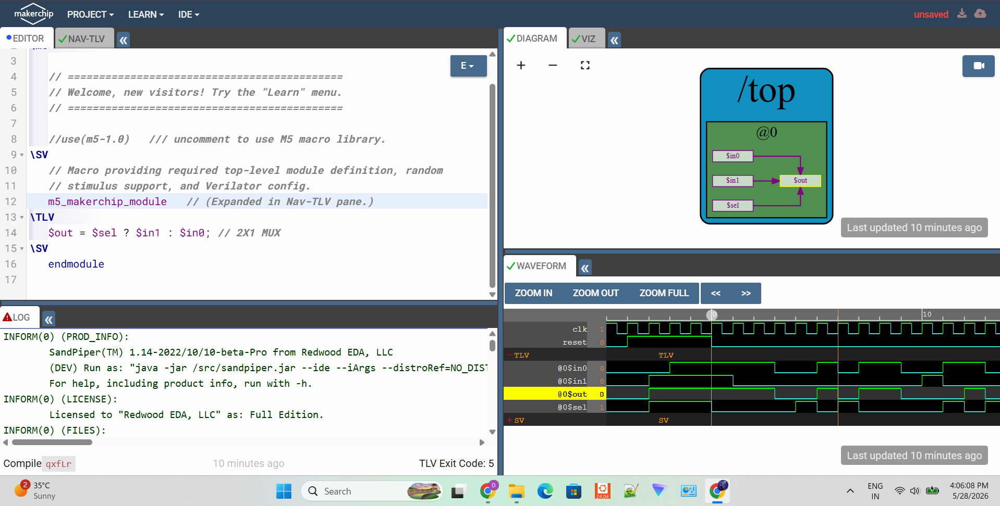

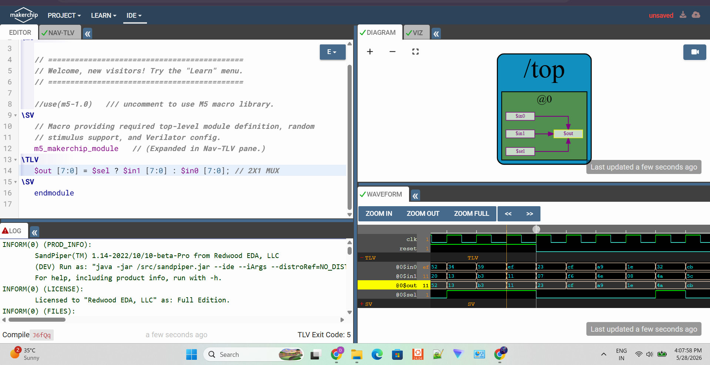

### Calculator

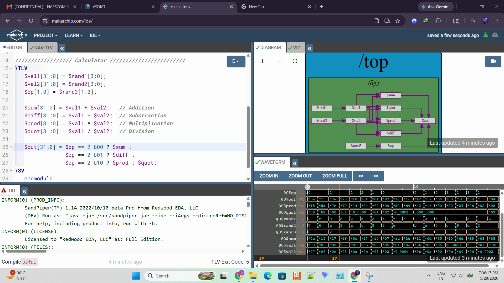

### Fibonacci Series

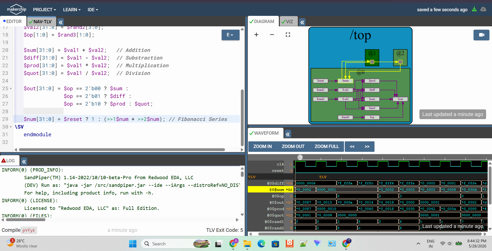

### Sequential Calculator

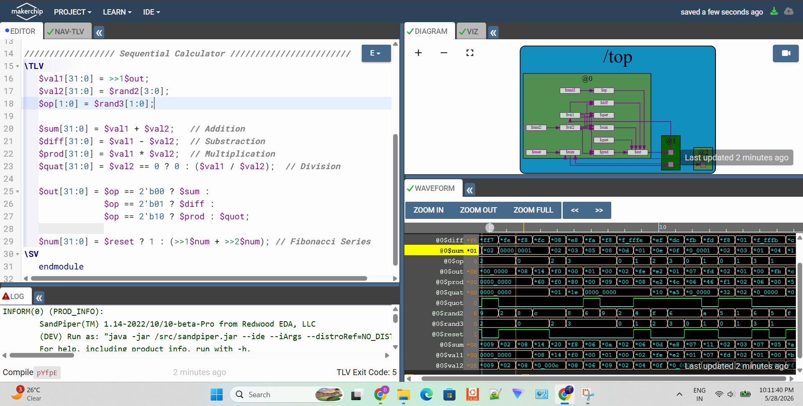

### Error Propagation

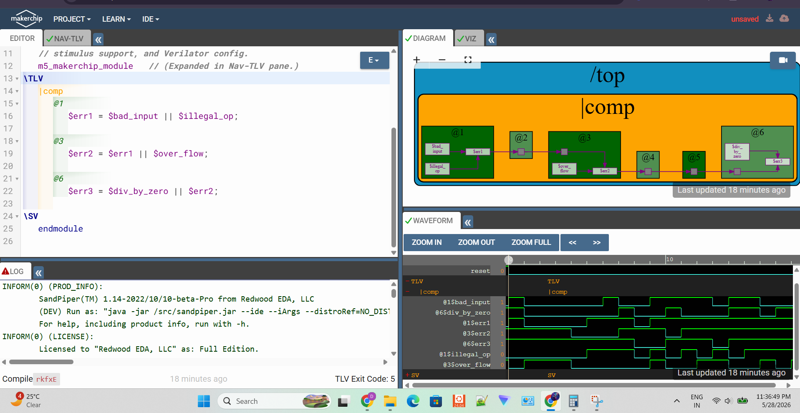

### Pipeline Counter Calculator

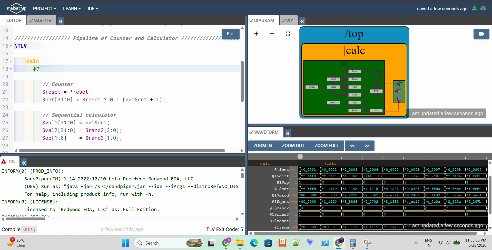

### Valid Signal

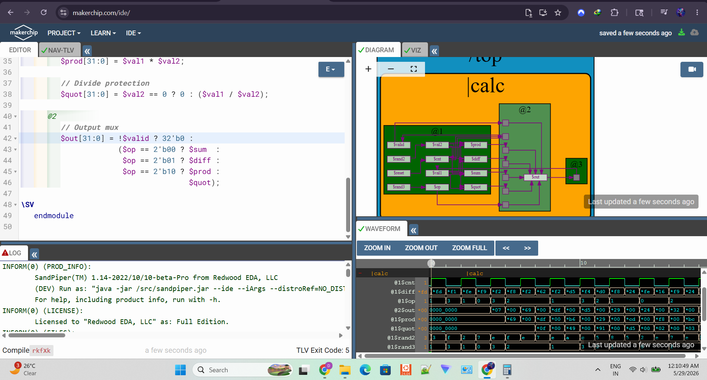

### Calculator With Validity

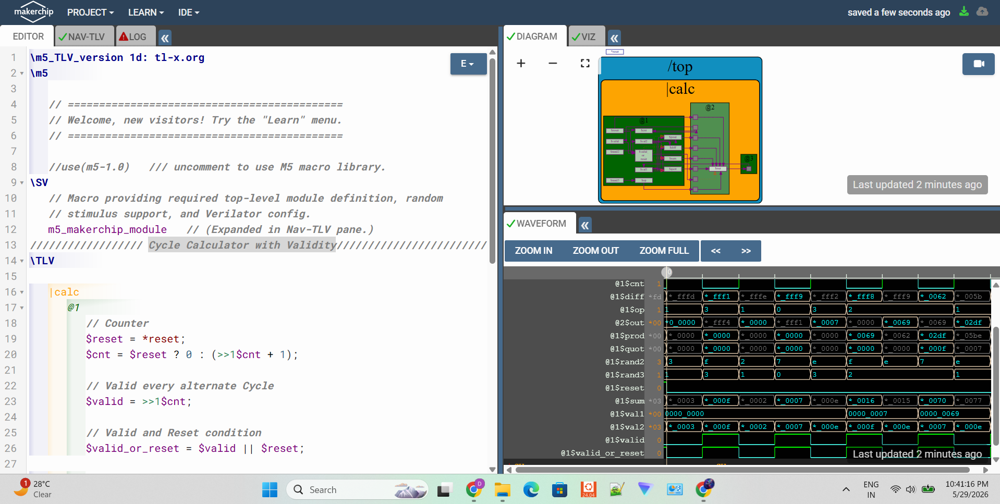

### Single Value Memory Calculator

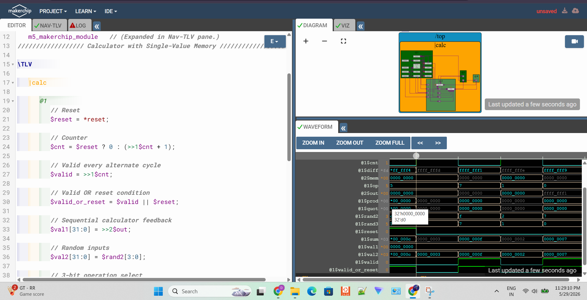

### 3D Distance Calculator

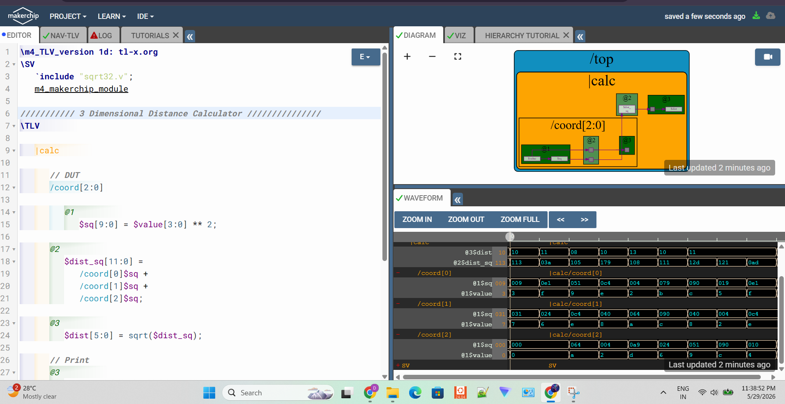


## Key Learnings

* TL-Verilog simplifies pipeline creation.
* Timing abstraction reduces manual register management.
* Feedback paths create sequential logic.
* Pipeline alignment is critical for correct operation.
* Validity signals control execution flow.
* Hierarchy enables scalable hardware design.

---

## Files

### Code

Located in:

```text
Day3/code/
```

### Screenshots

Located in:

```text
Day3/screenshots/
```

### Observations

Located in:

```text
Day3/observations.md
```
